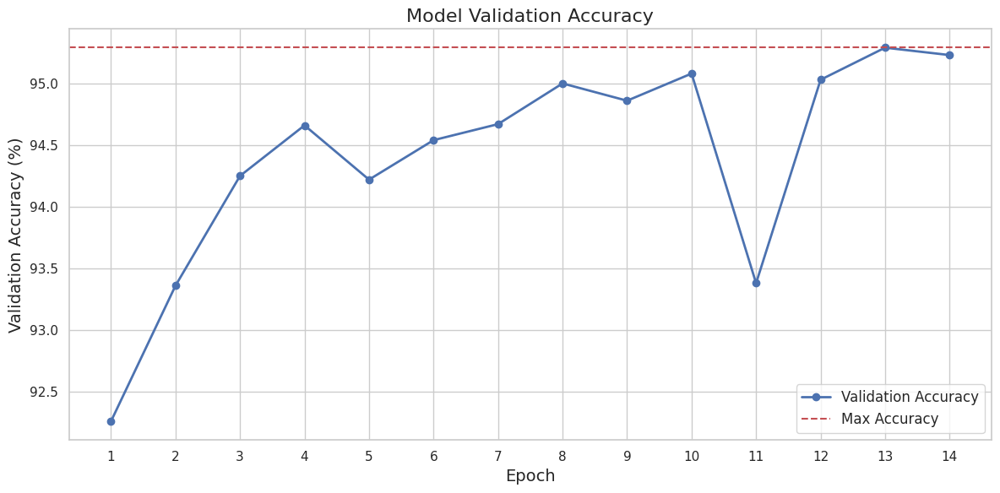
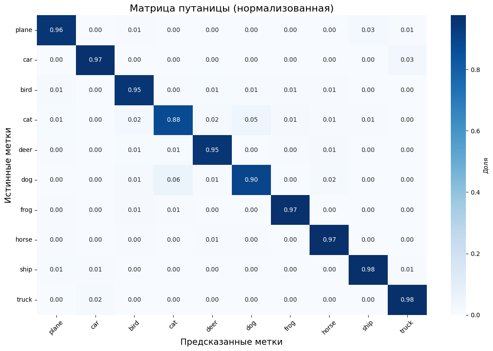

# CIFAR-10 Image Classifier with PyTorch and Streamlit

[](https://visionforgecifar10.streamlit.app/)

## 🚀 Краткое описание

Классификатор изображений CIFAR-10 на базе PyTorch с использованием **ResNet18**, расширенной SE-блоками. Модель обучена в Google Colab (GPU), а затем развернута как интерактивное веб-приложение через Streamlit.

<figure>
    
    <figcaption>
        <b>Пример:</b> Скриншот Streamlit приложения.
    </figcaption>
</figure>

## 🎯 Цель проекта

- Практическая реализация ML-пайплайна: от данных до продакшена  
- Создание интерактивного интерфейса для демонстрации модели  
- Оптимизация гиперпараметров через библиотеку Optuna

## 🛠️ Установка и запуск

1. Установите зависимости:

   ```bash
   pip install -r requirements.txt
   ```

2. Запустите Streamlit приложение:

    ```bash
    streamlit run src/app.py
    ```

Для работы с блокнотом в Google Colab:

- Откройте notebooks/training_and_tuning.ipynb в Colab.
- Подключите GPU для ускорения обучения.

## 🏛️ Архитектура модели

### ResNet18 с SE-блоками

- Squeeze-and-Excitation (SE) блоки: Добавлены после каждого сверточного блока для улучшения карт признаков.
- Замораживание слоев: Исходные слои ResNet заморожены, дообучаются только последние 3 уровня.
- Доработка: Замена финального FC-слоя для 10 классов CIFAR-10.

## 💼 Этапы работы

1. Подготовка данных:
    - Разделение на обучающую/валидационную/тестовую выборки (80/10/10).
    - Использование DataLoader с воспроизводимыми настройками.

2. Поиск гиперпараметров через Optuna:
    - Оптимизируемые параметры: lr, batch_size, weight_decay, epochs, patience.
    - Результаты сохранены в best_params.json.

3. Обучение модели:
    - Оптимизатор: Adam.
    - Планировщик скорости обучения: ReduceLROnPlateau.
    - Ранняя остановка при отсутствии улучшений.

4. Оценка:
    - Точность на тестовом наборе: ~95.08%.
    - Визуализация матрицы ошибок и графиков обучения.

График точности:


## 📊 Результаты

- Точность модели: 95.08% на тестовом наборе данных.
- Ключевые гиперпараметры:
  - Learning Rate: 6.595
  - Batch Size: 32
  - Epochs: 14
- Интересные наблюдения:
  - Использование аугментации данных значительно улучшило обобщающую способность модели.
  - Оптимизация гиперпараметров с помощью Optuna позволила достичь высокой точности.

Матрица ошибок:


## 📜 Лицензия

Проект доступен по лицензии MIT. Подробности см. в файле [LICENSE](./LICENSE).

## 🙏 Благодарности

- PyTorch и Streamlit за предоставленные инструменты.
- Optuna для оптимизации гиперпараметров.
- Google Colab за GPU ресурсы.
